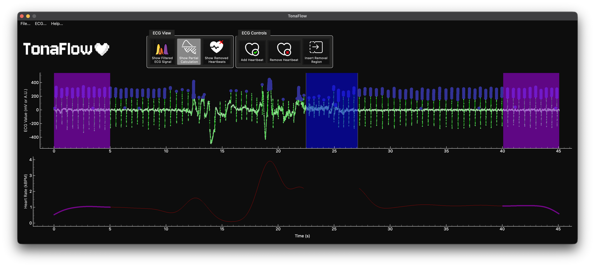

<div align="center">
  <picture>
    <source media="(prefers-color-scheme: dark)" srcset="imgs/logos/TonaFlow_DarkMode.png">
    <source media="(prefers-color-scheme: light)" srcset="imgs/logos/TonaFlow_LightMode.png">
    
  </picture>

  <h1><strong>A free and open-source program for ECG processing</strong></h2>

  [](https://www.gnu.org/licenses/gpl-3.0)
  [](https://github.com/borjonlab/TonaFlowPy/releases/tag/v0.0.1)
  <p>
    Manash Sahoo<sup>1,2</sup> &nbsp;·&nbsp;
    Katherine D. Rhodes<sup>1,2</sup> &nbsp;·&nbsp;
    Valerie P. Bambha<sup>1,2</sup> &nbsp;·&nbsp;
    Natasha Mbajonas &nbsp;·&nbsp;
    Jeremy I. Borjon<sup>1,2,3,4</sup>
  </p>

  <sub>
    <sup>1</sup> Department of Psychology, University of Houston, USA &nbsp;|&nbsp;
    <sup>2</sup> Texas Institute for Measurement, Evaluation, and Statistics, University of Houston, USA<br>
    <sup>3</sup> Texas Center for Learning Disorders, USA &nbsp;|&nbsp;
    <sup>4</sup> Department of Child and Adolescent Psychiatry and Psychotherapy, Heidelberg University Hospital, Heidelberg University, German Center for Mental Health (DZPG)
  </sub>

  

</div>

---

## 📖 About



Deriving heart rate from a raw electrocardiogram (ECG) signal is not trivial. Efficient processing requires a multi-stage pipeline involving manual inspection and analytically informed decisions for filtering, R-peak detection, and noise removal. Currently, much of the existing software for this is expensive and closed-source, while free alternatives require programming experience and limit accessibility. **TonaFlow** is a one-click application that is free, open-source, and accessible to researchers of all career stages and technical backgrounds.

---

## ⚙️ Installation

### Option 1 — Executable (recommended)

Download the latest portable executable for your platform:

> **[⬇ Download TonaFlow — Linux · macOS · Windows](https://github.com/borjonlab/TonaFlowPy/releases/tag/Latest)**

### Option 2 — Run from source

```bash
# Clone the repo
git clone https://github.com/borjonlab/TonaFlowPy.git
cd TonaFlowPy

# Create a virtual environment and install dependencies
python -m venv ./venv
source ./venv/bin/activate
pip install -r requirements.txt

# Run
python TonaFlow.py
```

### Option 3 — Build from source

```bash
git clone https://github.com/borjonlab/TonaFlowPy.git
cd TonaFlowPy

# Create a virtual environment and install dependencies
python -m venv ./venv
source ./venv/bin/activate
pip install -r requirements.txt

# Run the PyInstaller build script
python3 build_tonaflow.py

# The executable will be output to /dists/
```

---

## 💬 Feedback

We want TonaFlow to make things easier, not harder. Let us know what you love, hate, or would like in the next release by filling out this short survey!

---

## ⚖️ License

This project is licensed under the **[GNU GPLv3](https://www.gnu.org/licenses/gpl-3.0)** and is provided to the user "as is."
